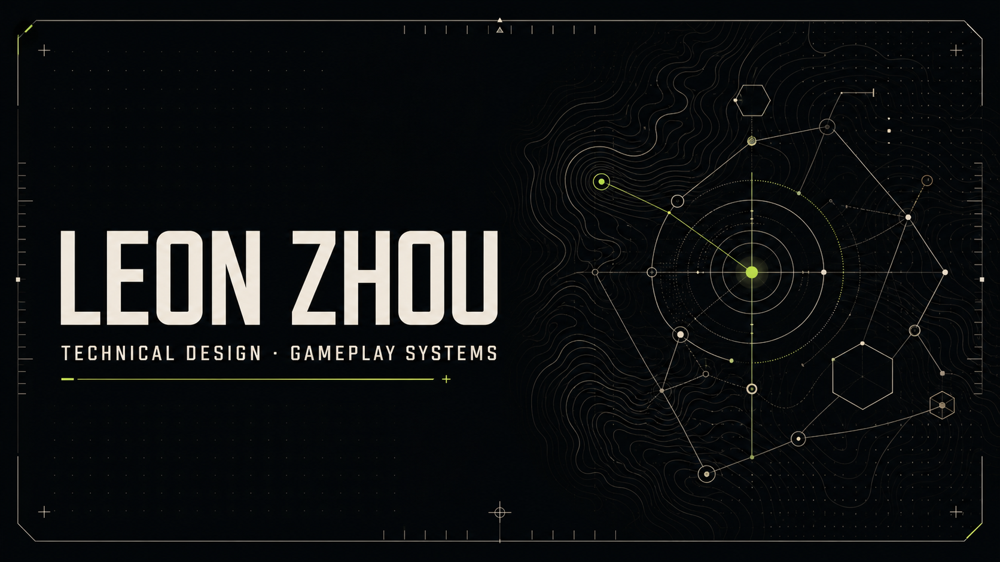

# Leon Zhou — Technical Designer Portfolio

[](https://hubr1zz.github.io/Portfolio/)



A personal portfolio presenting my work across technical design, gameplay programming, game development, and systems design. The site connects design intent with implementation through selected projects, process breakdowns, and interactive visual presentations.

## Explore the portfolio

- **Technical Projects** — Unity tools, gameplay architecture, procedural animation, and real-time rendering studies.
- **Game Projects** — Shipped and experimental games with notes on design, engineering, production, and collaboration.
- **Design Experience** — Systems-design documents, mechanics analysis, and development methodology.

Visit the live site: **[hubr1zz.github.io/Portfolio](https://hubr1zz.github.io/Portfolio/)**

## Selected work

- [zWorkFlow](https://github.com/Hubr1zz/zWorkFlow) — An AI-assisted game-production workflow that turns design documents into reviewable specifications, implementation plans, and traceable decisions.
- [Tactical Game Design Document](https://github.com/Hubr1zz/GameDesignVault) — A living systems-design document managed through GitHub as an evolving source of truth.
- **ActionQueue** — In preparation as a future featured project.

## Other

The Other area includes [Games I Played](https://hubr1zz.github.io/Portfolio/other/games/), with a primary play-history view and an additional family-library collection, plus smaller projects and experiments outside the main portfolio categories.

## Built with

- React and TypeScript
- Next-compatible routing with Vinext
- CSS and procedural SVG interaction and motion
- GitHub Actions and GitHub Pages
- OpenAI Sites as a secondary deployment target

The same source supports both a Worker build and a GitHub Pages static export. GitHub Pages paths are generated automatically from the repository name.

## Local development

Node.js `22.13.0` or newer is required.

```bash
npm install
npm run dev
```

Then open the local URL shown in the terminal.

## Validation

```bash
npm run lint
npm test
```

## Deployment

Every push to `main` runs the [GitHub Pages deployment workflow](./.github/workflows/deploy-pages.yml). The repository must use **Settings → Pages → Source: GitHub Actions**.

The production address for this repository is:

```text
https://hubr1zz.github.io/Portfolio/
```

## Contact

- Email: [leonzhouziang@gmail.com](mailto:leonzhouziang@gmail.com)
- GitHub: [@Hubr1zz](https://github.com/Hubr1zz)
- Itch.io: [leon-zhou.itch.io](https://leon-zhou.itch.io/)

## Content and usage

Portfolio text, design documents, project media, and visual assets are © Leon Zhou unless otherwise noted. The repository is publicly viewable for portfolio and technical-reference purposes; no license for reuse or redistribution is granted unless stated in an individual project.
